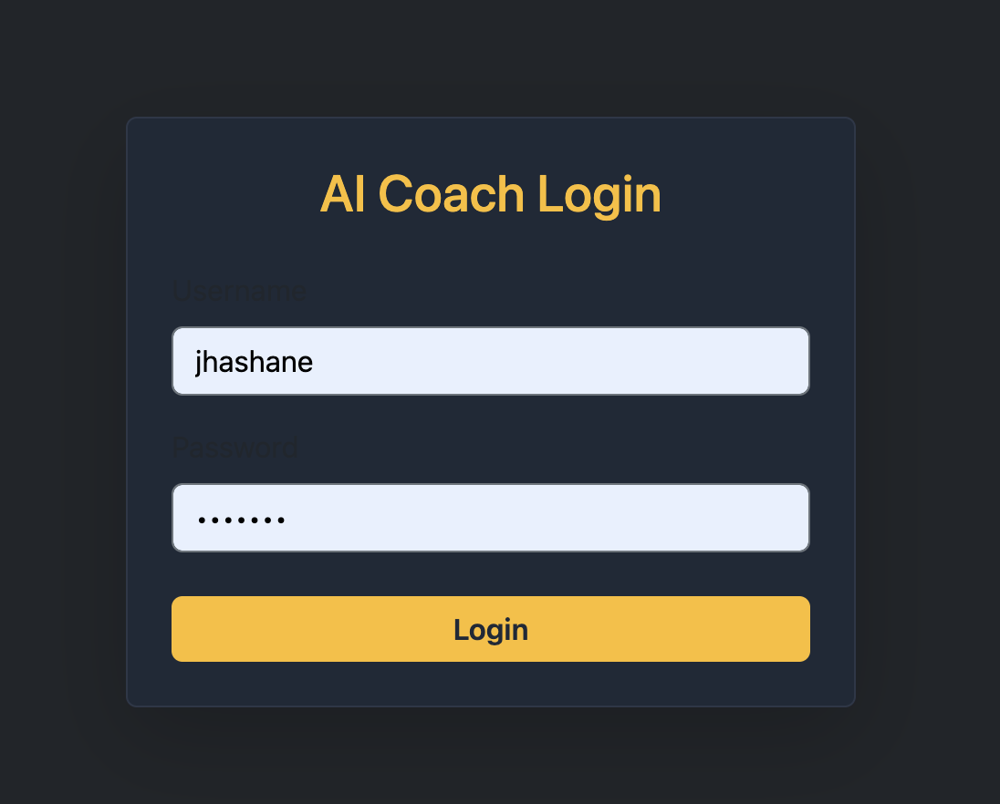
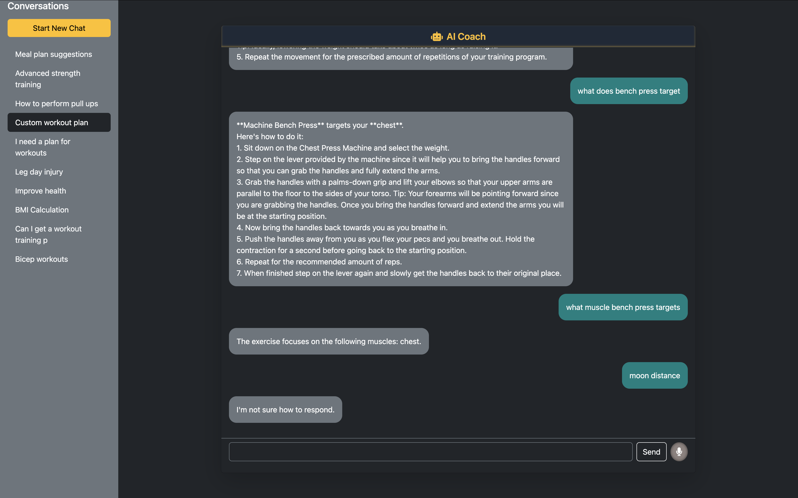

# 🧠 AI Coach — React Client

This is the frontend for **AI Coach**, an intelligent personal training chatbot application built using **React**, **TypeScript**, and **Bootstrap 5**. It connects to a FastAPI backend and provides users with a dark-themed, modern interface to chat with their virtual AI fitness coach.

---

## 🚀 Features

- ⚛️ Built with React + TypeScript
- 🔒 JWT-based authentication with protected routes
- 💬 Chat interface with styled message bubbles
- 🎤 Voice input using Speech Recognition API
- 💾 Persistent conversation handling
- 🌙 Dark theme with a clean, professional UI
- 📱 Responsive layout with Bootstrap

---

## 🖥️ Screenshots

| Login Page                        | Chat Interface                  |
| --------------------------------- | ------------------------------- |
|  |  |

---

## 📦 Tech Stack

- **React** with **TypeScript**
- **Bootstrap 5** for layout and styles
- **Axios** for HTTP requests
- **React Router** for navigation
- **Font Awesome** for icons
- **React Speech Recognition** for voice input
- **JWT Authentication** via AuthContext
- **LocalStorage** for session and conversation state

---

## 🛠️ Getting Started

### 1. Clone the repo

```bash
git clone https://github.com/your-username/ai-coach-client.git
cd ai-coach-client
```

### 2. Install dependencies

```bash
npm install
# or
yarn install
```

### 3. Configure Environment

Create a .env file and specify your API base URL:

```bash
REACT_APP_API_BASE_URL=http://localhost:8000
```

### 4. Run the development server

```bash
npm start
```

## 🔐 Authentication

This client uses JWT authentication with refresh tokens stored in cookies. Protected routes are wrapped with <PrivateRoute /> and user session is handled via a global AuthContext.

## 📁 Project Structure

```bash
src/
├── components/
│   ├── Chat.tsx
│   ├── ChatWindow.tsx
│   ├── ConversationItem.tsx
│   ├── Login.tsx
│   ├── MessageBubble.tsx
│   ├── NewChat.tsx
│   ├── Sidebar.tsx
│   ├── SoeechInput.tsx
│   └── Login.tsx
├── context/
│   └── AuthContext.tsx
├── routes/
│   └── PrivateRoute.tsx
├── services/
│   └── axios.ts
├── app.css
└── App.tsx
```
